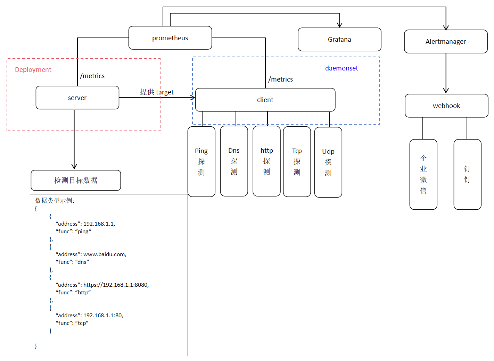
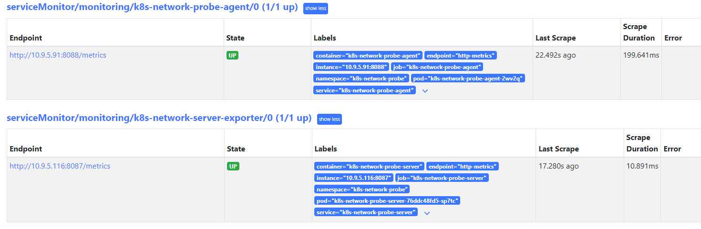
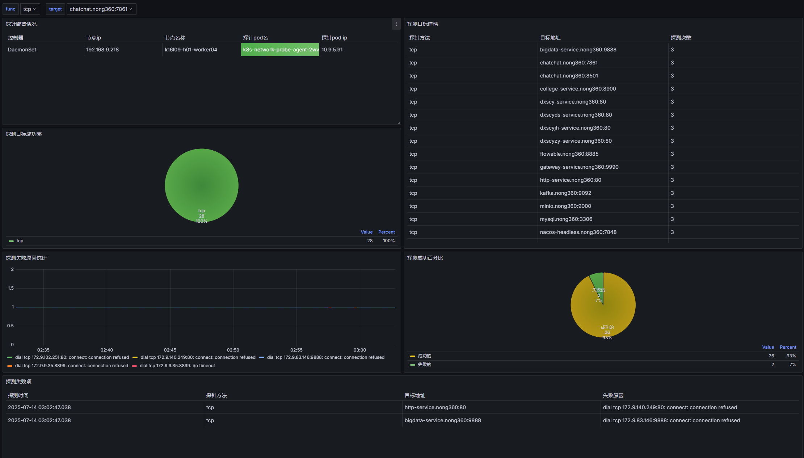
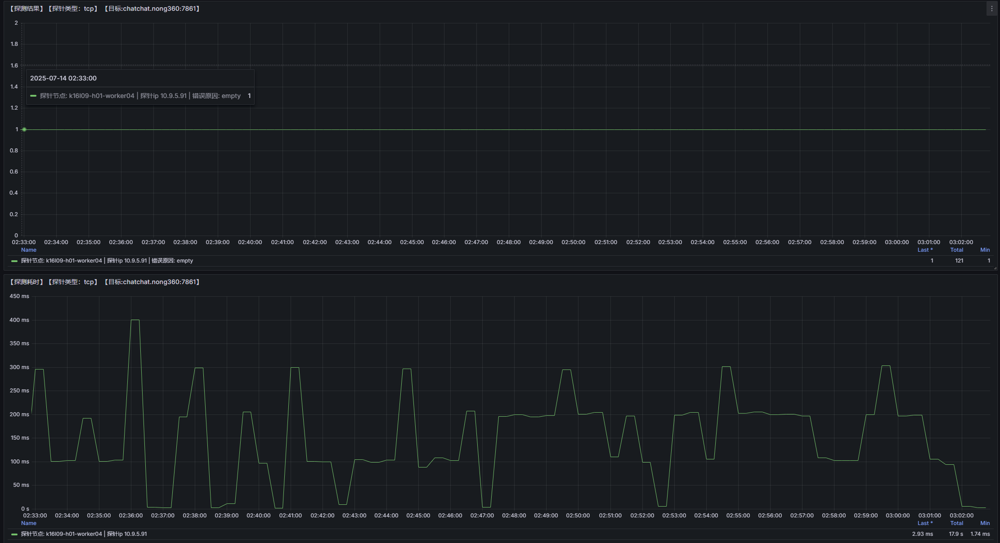

# 简介
k8s-network-probe网络探测,用于探测k8s内各项服务指标是否正常，包含tcp、udp、ping、dns、http探测,采用serviceMonitor方式管理，
集成grafana可视化监控指标，可自定义alermanagerRule配合webhook进行告警。
### 运行介绍
1、/bin/build.sh 请在docker环境下运行，且修改文件内容，修改包括harbor地址等等。

2、/bin/run.sh 请在k8s环境下运行

3、/alertmanager/alertmanager.yaml 修改问价那内容，改webhook的具体部署地址和token。

4、/webhook/hook_project 程序建议在docker下运行，非k8s环境，能连接外网，目前url是企业微信的webhook，只需传入token即可。运行启动docker-compose up -d
### 编译
```shell

```
### 启动
```shell

```

### 代码结构


### 项目架构


### 展示
（1）prometheus-target

（2）grafana

